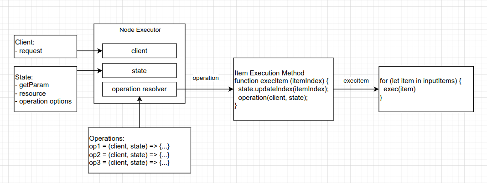
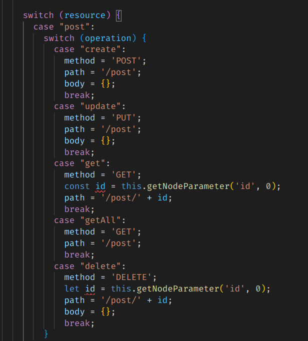

> "Any fool can write code that a computer can understand. Good programmers write code that humans can understand." — Martin Fowler. https://faun.pub/solid-principles-a5c650fcf30

# n8n Design Patterns Tutorial

n8n-designpatterns is a collection of interfaces and classes helping to follow [Segregation of Concerns](https://en.wikipedia.org/wiki/Separation_of_concerns) principle. Following this principle makes the code you are working with:
- readable
- maintainable
- extensible

We start with [n8n Node](https://docs.n8n.io/) implementation that violates Segregation of Concerns principle and write all the logic in long single function.

Then, step by step, we will refactor this code, extracting independent entities, and finally get a repository with clean code, compliant with the established requirements: readability, maintainability, extensibility.

Usefull links:
- https://github.com/webpro/programming-principles

# TL/DR - Summary

We will split [single node execution method](https://github.com/digital-boss/n8n-nodes-designpatterns-tutorial/blob/step3-2/nodes/FakeCrm/FakeCrm.node.ts) and extract these entities:

- [input items iterator](https://github.com/digital-boss/n8n-nodes-designpatterns-tutorial/blob/step4-4/nodes/FakeCrm/backend/getNodeExecFn.ts)
  - iterate through input items, gather results
  - handle continueOnFail
  - call __execution item method__
- [operation functions](https://github.com/digital-boss/n8n-nodes-designpatterns-tutorial/blob/step4-4/nodes/FakeCrm/backend/operations.ts): receives state and client. Getting all information from State, operation constructs final look of request options and pass it to HttpClient. Also operations handles response formatting.
- [state](https://github.com/digital-boss/n8n-nodes-designpatterns-tutorial/blob/step4-4/nodes/FakeCrm/backend/State.ts): Know all about current Node state:
  - provide parameter values
  - knows about selected operation options (endpoint url, path params placeholders, http method).
- client: [HttpClient](https://github.com/digital-boss/n8n-nodes-designpatterns-tutorial/blob/step4-4/nodes/FakeCrm/backend/HttpClientBasic.ts), handling Basic user Authentication.  
- [operation resolver](https://github.com/digital-boss/n8n-nodes-designpatterns-tutorial/blob/step4-4/nodes/FakeCrm/backend/ResOpResolver.ts): based on the current parameters it resolves operation method, that should be executed.
- [node executor](https://github.com/digital-boss/n8n-nodes-designpatterns-tutorial/blob/step4-4/nodes/FakeCrm/FakeCrm.node.ts#L75): Executes once (not for each item) during execution process and:
  - create instances of:
    - httpClient
    - state
    - operationResolver
  - return [__execution item method__](https://github.com/digital-boss/n8n-nodes-designpatterns-tutorial/blob/step4-4/nodes/FakeCrm/FakeCrm.node.ts#L87) which then will be passed to [input items iterator](https://github.com/digital-boss/n8n-nodes-designpatterns-tutorial/blob/step4-4/nodes/FakeCrm/backend/getNodeExecFn.ts).



Depending on your experience, preparedness and available time there are several ways 
to follow the tutorial:
1. Shortest - read only this TL/DR section
1. Read whole article and look what changed on each step, using [generated diffs](https://github.com/digital-boss/n8n-designpatterns/blob/version-0.1.2/docs/generated/index.md) and github compare web tool (there are links in generated docs).
1. If you want to play with code, make edits and run the results yourself, but do not inspired by copying & pasting all the code, then you can use branches from [n8n-nodes-designpatterns-tutorial](https://github.com/digital-boss/n8n-nodes-designpatterns-tutorial) repository. You can `git checkout` any step you want and `git merge` from next step to see what exactly changed using your favorite diff viewer / code editor. More details about this method below. 
1. Finaly, you can create all the code completelly by yourself, step by step.

# Preparations

We will use [Fake CRM API](https://github.com/digital-boss/fakecrm) for our new Node. It's a fake API, specially created for tutorials like this. 

Simplest way to run Fake CRM API is from docker image: `docker run -d -p 3000:3000 maestrow/fakecrm`.

You can open [generated diffs](https://github.com/digital-boss/n8n-designpatterns/blob/version-0.1.2/docs/generated/index.md) in browser tab to compare changes between steps.


## Using [n8n-nodes-designpatterns-tutorial](https://github.com/digital-boss/n8n-nodes-designpatterns-tutorial) repo

If you don't want to work with code and only want to read an article, then you can skip this section (but then use [generated diffs](https://github.com/digital-boss/n8n-designpatterns/blob/version-0.1.2/docs/generated/index.md)).

Clone the repo:

    git clone git@github.com:digital-boss/n8n-nodes-designpatterns-tutorial.git

Enter repo directory:

    cd n8n-nodes-designpatterns-tutorial

Pull all branches:

    git branch -r | grep -v '\->' | sed "s,\x1B\[[0-9;]*[a-zA-Z],,g" | while read remote; do git branch --track "${remote#origin/}" "$remote"; done
    git fetch --all
    git pull --all

Ensure youhave all branches locally:

  git brances

You should get:

```
* step1
  step2
  step3-1
  step3-2
  step4-1
  step4-2
  step4-3-1
  step4-3-2
  step4-3-3
  step4-3-4
  step4-4
  step5
```

Go to step (i.e. step 3.1):

    git checkout step3-1

See diff with the next (or any future) step:

    git merge step3-2 --no-commit --no-ff

This will merge (but not commit) next step to current working copy. You can see diff for all files using your favorite diff tool or code editor. Or just `git status` and `git diff`. 

To cleanup your working copy:

    git reset --hard 
    
This removes staged and working directory changes.

## Node UI debug

If you want to output Node parameters names and values, put this code snippet in `FakeCrm.execute` method:
```ts
    const params0 = this.getNode().parameters;
    const paramsWithValues0 = Object.keys(params0).map(name => [name, this.getNodeParameter(name, 0)]);
    const res0 = Object.fromEntries(paramsWithValues0);
    return [this.helpers.returnJsonArray(res0)];
```

So all preparations are done. Let's get started.

# Step 1: Generate new package and Node

On step1 we just generate a new package and Node. We will use [n8n-code-generator](https://github.com/digital-boss/n8n-node-generator/tree/main/packages/n8n-code-generator).


    git clone git@github.com:digital-boss/n8n-node-generator.git
    cd n8n-node-generator/packages/n8n-code-generator
    npm i
    npm build
## Generation script

Your generation script to generate a new package and node can looks like this:

```ts
const baseDir = '/path/to/basedir';

const packageParams = newPackage({
  ns: 'digital-boss',
  suffix: 'designpatterns-tutorial',
  baseDir,
});

const node = newNode({
  package: packageParams,
  nodeName: 'FakeCrm',
  brandColor: '#43a35d',
});

const tasks: Task[] = [
  () => removeIfExists(packageParams.packageDir),
  createPackage(packageParams, 'templates/starter'),
  createNode(node, 'templates/node', 'templates/creds/three-fields.ts'),
  () => exec(`cd ${packageParams.packageDir} && git init`, execLog),
];

const root = new TasksContainer(tasks);
root.run();
```

Save it to `src/scripts/local` subfolder with name `tutorial.ts`. And run `npm run exec src/scripts/local/tutorial.ts`.

## Build and run n8n with generated Node

- cd into newly create `n8n-nodes-designpatterns-tutorial` package dir
- npm i
- npm run gen
- npm run build
- npm link
- at n8n local instance
  - `npm link -S @digital-boss/n8n-nodes-designpatterns-tutorial` - add link to new package
  - `npx n8n` - start local instance


# Step 2: Make a UI

On previous first step we just generated new package and node. On this second step we create a UI for Node, consuming [Fake CRM API](https://github.com/digital-boss/fakecrm).

Changes:

[github compare](https://github.com/digital-boss/n8n-nodes-designpatterns-tutorial/compare/step1...step2) | [go to details](step1__step2.md)

- [nodes/FakeCrm/descriptions/types.ts](https://github.com/digital-boss/n8n-nodes-designpatterns-tutorial/raw/06e7eb5cb2927253d74abe775d55b527cfb3593a/nodes%2FFakeCrm%2Fdescriptions%2Ftypes.ts) modified [2,2,4]. Make method and path parameters for IOperation optional. Later in this tutorial we'll bring them back and make use of them.
- [nodes/FakeCrm/descriptions/gen.ts](https://github.com/digital-boss/n8n-nodes-designpatterns-tutorial/raw/06e7eb5cb2927253d74abe775d55b527cfb3593a/nodes%2FFakeCrm%2Fdescriptions%2Fgen.ts) modified [5,1,6]. Add transformer to setup display name for resources and operations from its names.
- [nodes/FakeCrm/descriptions/FakeCrm.description.yaml](https://github.com/digital-boss/n8n-nodes-designpatterns-tutorial/raw/06e7eb5cb2927253d74abe775d55b527cfb3593a/nodes%2FFakeCrm%2Fdescriptions%2FFakeCrm.description.yaml) modified [59,233,292]. Create node description in yaml for FakeCrm API.
- [credentials/FakeCrmApi.credentials.ts](https://github.com/digital-boss/n8n-nodes-designpatterns-tutorial/raw/06e7eb5cb2927253d74abe775d55b527cfb3593a/credentials%2FFakeCrmApi.credentials.ts) modified [4,24,28]
- [nodes/FakeCrm/FakeCrm.node.ts](https://github.com/digital-boss/n8n-nodes-designpatterns-tutorial/raw/06e7eb5cb2927253d74abe775d55b527cfb3593a/nodes%2FFakeCrm%2FFakeCrm.node.ts) modified [4,4,8]. Add generated description properties to FakeCrm class

# Step 3: Implementing without Separation of Concerns

Split this step into two and at step 3.1 just add a method structure. And at step 3.2 fill structure with logic.

## Step 3.1: Add boilerplate

Changes:

[github compare](https://github.com/digital-boss/n8n-nodes-designpatterns-tutorial/compare/step2...step3-1) | [go to details](step2__step3-1.md)

- [nodes/FakeCrm/FakeCrm.node.ts](https://github.com/digital-boss/n8n-nodes-designpatterns-tutorial/raw/23518e90acee841708f2ea035012defd527f7268/nodes%2FFakeCrm%2FFakeCrm.node.ts) modified [62,8,70] [prev](https://github.com/digital-boss/n8n-nodes-designpatterns-tutorial/raw/06e7eb5cb2927253d74abe775d55b527cfb3593a/nodes%2FFakeCrm%2FFakeCrm.node.ts)

## Step 3.2: Implementing

Implementing Fake CRM API.

Changes:

[github compare](https://github.com/digital-boss/n8n-nodes-designpatterns-tutorial/compare/step3-1...step3-2) | [go to details](step3-1__step3-2.md)

- [nodes/FakeCrm/FakeCrm.node.ts](https://github.com/digital-boss/n8n-nodes-designpatterns-tutorial/raw/13f50acf40a51076ea7960a3b44228a30b52d6e0/nodes%2FFakeCrm%2FFakeCrm.node.ts) modified [67,11,78] [prev](https://github.com/digital-boss/n8n-nodes-designpatterns-tutorial/raw/23518e90acee841708f2ea035012defd527f7268/nodes%2FFakeCrm%2FFakeCrm.node.ts)
- [nodes/FakeCrm/GenericFunctions.ts](https://github.com/digital-boss/n8n-nodes-designpatterns-tutorial/raw/13f50acf40a51076ea7960a3b44228a30b52d6e0/nodes%2FFakeCrm%2FGenericFunctions.ts) added [45,0,45]
- [workflows/test.json](https://github.com/digital-boss/n8n-nodes-designpatterns-tutorial/raw/13f50acf40a51076ea7960a3b44228a30b52d6e0/workflows%2Ftest.json) added [321,0,321]

## Analyze

So after you add (or review) changes for this step, let's analyze the resulting code: 

Do you see (potential) problems?

1. We need to declare variables outside case clause (see image) 

. 

But what if different operations has same parameter and different type? What if total amount of different parameters in all operations will be large? Then variable definitions block will be large too and will contains variables for all operations, all in one place - mess.

2. We could get this code. And it will be successfully compiled. But do you see error?

```ts
  case "getAll":
    method = 'GET';
    id = this.getNodeParameter('postId', 0) as string;
    path = `/post/${postId}/comment`;
    break;
```
- Here we inteted to put `id` parameter in path, but made a mistake and put `postId` name. And there is no error, because `postId` variable is declared before too! 
- Easy to forget item index (here we put 0 instead of variable).

3. When list grows - its harder to track on what indentation level you are (is it operation case, or resourse case or what?...)

4. Look at `tagsColl1` and `tagsColl2` constants. If you want to use same constant for different operations - you can't. Only variables, but they must be the same type. 

5. How to modify result of any specific operation?


# Step 4: Extract

At these steps we will refactor badly designed code to conform Separation of Concerns principle.

## Step 4.1: Extract input items iteration

On this step we'll extract __input items iteration__ function. It is responsible for:
- iteration on input items, 
- composing result array, 
- handling continueOnFail.

This functionality is copying & pasting from one node to another, so it'll be definitelly usefull to make a generic one.

Changes:

[github compare](https://github.com/digital-boss/n8n-nodes-designpatterns-tutorial/compare/step3-2...step4-1) | [go to details](step3-2__step4-1.md)

- [nodes/FakeCrm/FakeCrm.node.ts](https://github.com/digital-boss/n8n-nodes-designpatterns-tutorial/raw/61b65ab15e4bfaeb3013e3375011844572ec2d59/nodes%2FFakeCrm%2FFakeCrm.node.ts) modified [91,113,204] [prev](https://github.com/digital-boss/n8n-nodes-designpatterns-tutorial/raw/13f50acf40a51076ea7960a3b44228a30b52d6e0/nodes%2FFakeCrm%2FFakeCrm.node.ts)
- [nodes/FakeCrm/backend/getNodeExecFn.ts](https://github.com/digital-boss/n8n-nodes-designpatterns-tutorial/raw/61b65ab15e4bfaeb3013e3375011844572ec2d59/nodes%2FFakeCrm%2Fbackend%2FgetNodeExecFn.ts) added [25,0,25]


## Step 4.2: Extract operations functions

On step 3 we use switch-case statement to split code into operations. But this doesn't gives us __scope__ what causes (potential) problems. With functions we get individual variables scope for each operation. And we will not be constrained in declaring any variables and constants.

Changes:

[github compare](https://github.com/digital-boss/n8n-nodes-designpatterns-tutorial/compare/step4-1...step4-2) | [go to details](step4-1__step4-2.md)

- [nodes/FakeCrm/FakeCrm.node.ts](https://github.com/digital-boss/n8n-nodes-designpatterns-tutorial/raw/2e583788c20a30a22166f1c5e36c530ccd7c09c9/nodes%2FFakeCrm%2FFakeCrm.node.ts) modified [12,85,97] [prev](https://github.com/digital-boss/n8n-nodes-designpatterns-tutorial/raw/61b65ab15e4bfaeb3013e3375011844572ec2d59/nodes%2FFakeCrm%2FFakeCrm.node.ts)
- [nodes/FakeCrm/backend/operations.ts](https://github.com/digital-boss/n8n-nodes-designpatterns-tutorial/raw/2e583788c20a30a22166f1c5e36c530ccd7c09c9/nodes%2FFakeCrm%2Fbackend%2Foperations.ts) added [109,0,109]

Result:

- variables problem resolved. Each operation incapsulated in separate method. 
- update operations returns empty result, so we transform result to empty object: `return fakeCrmRequest.call(execFns, method, path, body).then(res => res || {});`. This modifications can't be easily implemented without extracting operation methods.


## Step 4.3: Apply Separation of Concerns to Operation

What else we can do with operations? Extract client and state.

Examples of clients: HTTP REST, LDAP, WebDAV, XML-RPC, SOAP, gRPC, GraphQL, and so on. 

State: knows all about node state. 
- Provide you with parameter values
- Knows about current operation
- provide request options for current operation by operation metadata (metadata: path, method, headers, etc).

Operation itself become a method that 
- with the help of State compose final request options
- and pass them to client.
- Then transforms response


  


### Step 4.3.1: Extract client

Approaches to implement client (from dedicated to universal)
1. Dedicated client (dedicated to Node)
2. Generic with Auth (Basic Auth, OAuth, ...)
3. Raw Protocol implementation.

Dedicated is justified for APIs where all parameters passed in the same way along all operations (for example json in request body, see Hostbill). But if API has some methods that accepts params in query string, other part - in body, trird - in url path (and this is the most common scenario), then usualy its more convenient to have universal client. Speaking Universal I mean it can receive OptionsWithUri, but besides just making request, it's responsible for authentication.

Dedicated clients adds one more entity to the whole system. Because is has its own interface and logic. Иге the Generic client is not, because it is the same well known client (HTTP) and we already know how to pass params to it.

Let's convert our client from semi-dedicated (that accepts method, path, body) to Generic with Auth, thus reducing numbers of entities by one. But at the same time we will make sure that maintainability, extensibility, readability of operation methods will remain the same.

Note that OptionsWithUri has auth property - and this is params for Basic Auth. So underlying http client already has implementation for basic auth. But to show how you can implement your own auth methods, I provide here HttpClient with Basic auth implementation. 

Changes:

[github compare](https://github.com/digital-boss/n8n-nodes-designpatterns-tutorial/compare/step4-2...step4-3-1) | [go to details](step4-2__step4-3-1.md)

- [credentials/FakeCrmApi.credentials.ts](https://github.com/digital-boss/n8n-nodes-designpatterns-tutorial/raw/2eca392a2e62b3417933f9b797ab493e8dcf4074/credentials%2FFakeCrmApi.credentials.ts) modified [19,2,21] [prev](https://github.com/digital-boss/n8n-nodes-designpatterns-tutorial/raw/06e7eb5cb2927253d74abe775d55b527cfb3593a/credentials%2FFakeCrmApi.credentials.ts). Make IFakeCrmApiCredentials credentials same as IBasicAuth to pass it without transform to HttpClient. 
- [nodes/FakeCrm/FakeCrm.node.ts](https://github.com/digital-boss/n8n-nodes-designpatterns-tutorial/raw/2eca392a2e62b3417933f9b797ab493e8dcf4074/nodes%2FFakeCrm%2FFakeCrm.node.ts) modified [10,4,14] [prev](https://github.com/digital-boss/n8n-nodes-designpatterns-tutorial/raw/2e583788c20a30a22166f1c5e36c530ccd7c09c9/nodes%2FFakeCrm%2FFakeCrm.node.ts)
- [nodes/FakeCrm/GenericFunctions.ts](https://github.com/digital-boss/n8n-nodes-designpatterns-tutorial/raw/2e583788c20a30a22166f1c5e36c530ccd7c09c9/nodes%2FFakeCrm%2FGenericFunctions.ts) removed [0,45,45] [prev](https://github.com/digital-boss/n8n-nodes-designpatterns-tutorial/raw/13f50acf40a51076ea7960a3b44228a30b52d6e0/nodes%2FFakeCrm%2FGenericFunctions.ts)
- [nodes/FakeCrm/backend/HttpClientBasic.ts](https://github.com/digital-boss/n8n-nodes-designpatterns-tutorial/raw/2eca392a2e62b3417933f9b797ab493e8dcf4074/nodes%2FFakeCrm%2Fbackend%2FHttpClientBasic.ts) added [33,0,33]
- [nodes/FakeCrm/backend/interfaces.ts](https://github.com/digital-boss/n8n-nodes-designpatterns-tutorial/raw/2eca392a2e62b3417933f9b797ab493e8dcf4074/nodes%2FFakeCrm%2Fbackend%2Finterfaces.ts) added [8,0,8]
- [nodes/FakeCrm/backend/operations.ts](https://github.com/digital-boss/n8n-nodes-designpatterns-tutorial/raw/2eca392a2e62b3417933f9b797ab493e8dcf4074/nodes%2FFakeCrm%2Fbackend%2Foperations.ts) modified [87,57,144] [prev](https://github.com/digital-boss/n8n-nodes-designpatterns-tutorial/raw/2e583788c20a30a22166f1c5e36c530ccd7c09c9/nodes%2FFakeCrm%2Fbackend%2Foperations.ts)

### Step 4.3.2: Extract state

Changes:

[github compare](https://github.com/digital-boss/n8n-nodes-designpatterns-tutorial/compare/step4-3-1...step4-3-2) | [go to details](step4-3-1__step4-3-2.md)

- [nodes/FakeCrm/FakeCrm.node.ts](https://github.com/digital-boss/n8n-nodes-designpatterns-tutorial/raw/1847b527dc813de36fe3b7dc595d94cefc7acde8/nodes%2FFakeCrm%2FFakeCrm.node.ts) modified [7,3,10] [prev](https://github.com/digital-boss/n8n-nodes-designpatterns-tutorial/raw/2eca392a2e62b3417933f9b797ab493e8dcf4074/nodes%2FFakeCrm%2FFakeCrm.node.ts)
- [nodes/FakeCrm/backend/State.ts](https://github.com/digital-boss/n8n-nodes-designpatterns-tutorial/raw/1847b527dc813de36fe3b7dc595d94cefc7acde8/nodes%2FFakeCrm%2Fbackend%2FState.ts) added [28,0,28]
- [nodes/FakeCrm/backend/interfaces.ts](https://github.com/digital-boss/n8n-nodes-designpatterns-tutorial/raw/1847b527dc813de36fe3b7dc595d94cefc7acde8/nodes%2FFakeCrm%2Fbackend%2Finterfaces.ts) modified [11,1,12] [prev](https://github.com/digital-boss/n8n-nodes-designpatterns-tutorial/raw/2eca392a2e62b3417933f9b797ab493e8dcf4074/nodes%2FFakeCrm%2Fbackend%2Finterfaces.ts)
- [nodes/FakeCrm/backend/operations.ts](https://github.com/digital-boss/n8n-nodes-designpatterns-tutorial/raw/1847b527dc813de36fe3b7dc595d94cefc7acde8/nodes%2FFakeCrm%2Fbackend%2Foperations.ts) modified [31,36,67] [prev](https://github.com/digital-boss/n8n-nodes-designpatterns-tutorial/raw/2eca392a2e62b3417933f9b797ab493e8dcf4074/nodes%2FFakeCrm%2Fbackend%2Foperations.ts)


And we can add other usefull methods to State which we are going to do on next steps of our refactoring journey.

### Step 4.3.3: Extract operation metadata to node description (yaml)

Configuration vs Convention: 

- If you have a bunch of resources and each of them implements CRUD with same operation names, such as: create, update, get, getAll, delete. And every method uses corresponding HTTP Method: POST, PUT, GET, GET, DELETE. Then we have easily formalisable rules for http method. And it's better to use convention in this case. On the other hand if operations on resources are different and there is no patterns recognized, then it's better to use configuration.

At this step we will move operations options (http method and url path) from operation logic to declarative structure (which is yaml in our case).

Changes:

[github compare](https://github.com/digital-boss/n8n-nodes-designpatterns-tutorial/compare/step4-3-2...step4-3-3) | [go to details](step4-3-2__step4-3-3.md)

- [nodes/FakeCrm/FakeCrm.node.ts](https://github.com/digital-boss/n8n-nodes-designpatterns-tutorial/raw/eef8ba9ebcbd4de67d4d337c2399efced3a45916/nodes%2FFakeCrm%2FFakeCrm.node.ts) modified [1,1,2] [prev](https://github.com/digital-boss/n8n-nodes-designpatterns-tutorial/raw/1847b527dc813de36fe3b7dc595d94cefc7acde8/nodes%2FFakeCrm%2FFakeCrm.node.ts)
- [nodes/FakeCrm/backend/State.ts](https://github.com/digital-boss/n8n-nodes-designpatterns-tutorial/raw/eef8ba9ebcbd4de67d4d337c2399efced3a45916/nodes%2FFakeCrm%2Fbackend%2FState.ts) modified [62,2,64] [prev](https://github.com/digital-boss/n8n-nodes-designpatterns-tutorial/raw/1847b527dc813de36fe3b7dc595d94cefc7acde8/nodes%2FFakeCrm%2Fbackend%2FState.ts)
- [nodes/FakeCrm/backend/operations.ts](https://github.com/digital-boss/n8n-nodes-designpatterns-tutorial/raw/eef8ba9ebcbd4de67d4d337c2399efced3a45916/nodes%2FFakeCrm%2Fbackend%2Foperations.ts) modified [14,71,85] [prev](https://github.com/digital-boss/n8n-nodes-designpatterns-tutorial/raw/1847b527dc813de36fe3b7dc595d94cefc7acde8/nodes%2FFakeCrm%2Fbackend%2Foperations.ts)
- [nodes/FakeCrm/descriptions/FakeCrm.description.yaml](https://github.com/digital-boss/n8n-nodes-designpatterns-tutorial/raw/eef8ba9ebcbd4de67d4d337c2399efced3a45916/nodes%2FFakeCrm%2Fdescriptions%2FFakeCrm.description.yaml) modified [20,0,20] [prev](https://github.com/digital-boss/n8n-nodes-designpatterns-tutorial/raw/06e7eb5cb2927253d74abe775d55b527cfb3593a/nodes%2FFakeCrm%2Fdescriptions%2FFakeCrm.description.yaml)
- [nodes/FakeCrm/descriptions/types.ts](https://github.com/digital-boss/n8n-nodes-designpatterns-tutorial/raw/eef8ba9ebcbd4de67d4d337c2399efced3a45916/nodes%2FFakeCrm%2Fdescriptions%2Ftypes.ts) modified [2,2,4] [prev](https://github.com/digital-boss/n8n-nodes-designpatterns-tutorial/raw/06e7eb5cb2927253d74abe775d55b527cfb3593a/nodes%2FFakeCrm%2Fdescriptions%2Ftypes.ts)


### Step 4.3.4: Fallback operation

You may be noticed that some of operation methods now looks identically. So lets be [DRY](https://ru.wikipedia.org/wiki/Don%E2%80%99t_repeat_yourself) and introduce so called fall back operation, which will be executed in cases when operation method isn't declared.

Changes:

[github compare](https://github.com/digital-boss/n8n-nodes-designpatterns-tutorial/compare/step4-3-3...step4-3-4) | [go to details](step4-3-3__step4-3-4.md)

- [nodes/FakeCrm/FakeCrm.node.ts](https://github.com/digital-boss/n8n-nodes-designpatterns-tutorial/raw/2f5935fc2cf3c0f16aa6c036148013a89a9bbcbc/nodes%2FFakeCrm%2FFakeCrm.node.ts) modified [3,5,8] [prev](https://github.com/digital-boss/n8n-nodes-designpatterns-tutorial/raw/eef8ba9ebcbd4de67d4d337c2399efced3a45916/nodes%2FFakeCrm%2FFakeCrm.node.ts)
- [nodes/FakeCrm/backend/operations.ts](https://github.com/digital-boss/n8n-nodes-designpatterns-tutorial/raw/2f5935fc2cf3c0f16aa6c036148013a89a9bbcbc/nodes%2FFakeCrm%2Fbackend%2Foperations.ts) modified [2,28,30] [prev](https://github.com/digital-boss/n8n-nodes-designpatterns-tutorial/raw/eef8ba9ebcbd4de67d4d337c2399efced3a45916/nodes%2FFakeCrm%2Fbackend%2Foperations.ts)


## Step 4.4: Extract operation resolver

Let's extract operation resolving logic into separate class.

Changes:

[github compare](https://github.com/digital-boss/n8n-nodes-designpatterns-tutorial/compare/step4-3-4...step4-4) | [go to details](step4-3-4__step4-4.md)

- [nodes/FakeCrm/FakeCrm.node.ts](https://github.com/digital-boss/n8n-nodes-designpatterns-tutorial/raw/68211b19ef29231bb87521f10da6326420bd5199/nodes%2FFakeCrm%2FFakeCrm.node.ts) modified [2,7,9] [prev](https://github.com/digital-boss/n8n-nodes-designpatterns-tutorial/raw/2f5935fc2cf3c0f16aa6c036148013a89a9bbcbc/nodes%2FFakeCrm%2FFakeCrm.node.ts)
- [nodes/FakeCrm/backend/ResOpResolver.ts](https://github.com/digital-boss/n8n-nodes-designpatterns-tutorial/raw/68211b19ef29231bb87521f10da6326420bd5199/nodes%2FFakeCrm%2Fbackend%2FResOpResolver.ts) added [32,0,32]
- [nodes/FakeCrm/backend/interfaces.ts](https://github.com/digital-boss/n8n-nodes-designpatterns-tutorial/raw/68211b19ef29231bb87521f10da6326420bd5199/nodes%2FFakeCrm%2Fbackend%2Finterfaces.ts) modified [4,0,4] [prev](https://github.com/digital-boss/n8n-nodes-designpatterns-tutorial/raw/1847b527dc813de36fe3b7dc595d94cefc7acde8/nodes%2FFakeCrm%2Fbackend%2Finterfaces.ts)


# Step 5: Introduce n8n-designpatters

On this, final step, we won't add nothing. We just replace all concepts we added on previous steps with same, but from [n8n-designpatterns](https://github.com/digital-boss/n8n-designpatterns) repository. All the entities discussed in this tutorial will occur in almost every node, so why not extract them into a separate package and reuse them?

Changes:


[github compare](https://github.com/digital-boss/n8n-nodes-designpatterns-tutorial/compare/step4-4...step5) | [go to details](step4-4__step5.md)

- [nodes/FakeCrm/FakeCrm.node.ts](https://github.com/digital-boss/n8n-nodes-designpatterns-tutorial/raw/4422e472d1f58d766d84f9aecfc08fdafcf50cd4/nodes%2FFakeCrm%2FFakeCrm.node.ts) modified [11,19,30] [prev](https://github.com/digital-boss/n8n-nodes-designpatterns-tutorial/raw/68211b19ef29231bb87521f10da6326420bd5199/nodes%2FFakeCrm%2FFakeCrm.node.ts)
- [nodes/FakeCrm/backend/HttpClientBasic.ts](https://github.com/digital-boss/n8n-nodes-designpatterns-tutorial/raw/4422e472d1f58d766d84f9aecfc08fdafcf50cd4/nodes%2FFakeCrm%2Fbackend%2FHttpClientBasic.ts) modified [1,1,2] [prev](https://github.com/digital-boss/n8n-nodes-designpatterns-tutorial/raw/2eca392a2e62b3417933f9b797ab493e8dcf4074/nodes%2FFakeCrm%2Fbackend%2FHttpClientBasic.ts)
- [nodes/FakeCrm/backend/ResOpResolver.ts](https://github.com/digital-boss/n8n-nodes-designpatterns-tutorial/raw/68211b19ef29231bb87521f10da6326420bd5199/nodes%2FFakeCrm%2Fbackend%2FResOpResolver.ts) removed [0,32,32] [prev](https://github.com/digital-boss/n8n-nodes-designpatterns-tutorial/raw/68211b19ef29231bb87521f10da6326420bd5199/nodes%2FFakeCrm%2Fbackend%2FResOpResolver.ts)
- [nodes/FakeCrm/backend/State.ts](https://github.com/digital-boss/n8n-nodes-designpatterns-tutorial/raw/4422e472d1f58d766d84f9aecfc08fdafcf50cd4/nodes%2FFakeCrm%2Fbackend%2FState.ts) modified [2,69,71] [prev](https://github.com/digital-boss/n8n-nodes-designpatterns-tutorial/raw/eef8ba9ebcbd4de67d4d337c2399efced3a45916/nodes%2FFakeCrm%2Fbackend%2FState.ts)
- [nodes/FakeCrm/backend/getNodeExecFn.ts](https://github.com/digital-boss/n8n-nodes-designpatterns-tutorial/raw/68211b19ef29231bb87521f10da6326420bd5199/nodes%2FFakeCrm%2Fbackend%2FgetNodeExecFn.ts) removed [0,25,25] [prev](https://github.com/digital-boss/n8n-nodes-designpatterns-tutorial/raw/61b65ab15e4bfaeb3013e3375011844572ec2d59/nodes%2FFakeCrm%2Fbackend%2FgetNodeExecFn.ts)
- [nodes/FakeCrm/backend/interfaces.ts](https://github.com/digital-boss/n8n-nodes-designpatterns-tutorial/raw/68211b19ef29231bb87521f10da6326420bd5199/nodes%2FFakeCrm%2Fbackend%2Finterfaces.ts) removed [0,22,22] [prev](https://github.com/digital-boss/n8n-nodes-designpatterns-tutorial/raw/68211b19ef29231bb87521f10da6326420bd5199/nodes%2FFakeCrm%2Fbackend%2Finterfaces.ts)
- [nodes/FakeCrm/backend/operations.ts](https://github.com/digital-boss/n8n-nodes-designpatterns-tutorial/raw/4422e472d1f58d766d84f9aecfc08fdafcf50cd4/nodes%2FFakeCrm%2Fbackend%2Foperations.ts) modified [3,2,5] [prev](https://github.com/digital-boss/n8n-nodes-designpatterns-tutorial/raw/2f5935fc2cf3c0f16aa6c036148013a89a9bbcbc/nodes%2FFakeCrm%2Fbackend%2Foperations.ts)